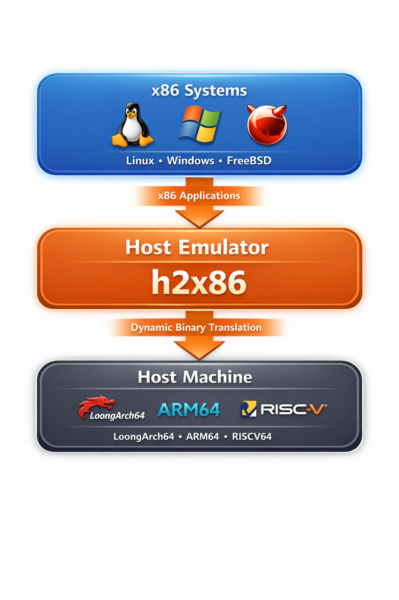

<div align="center">



# h2x86

**在非 x86 主机上启动并运行 x86-64 操作系统**

支持 **LoongArch64**、**ARM64**、**RISC-V64** 主机，通过 QEMU TCG 全系统模拟运行 **Linux** 与 **Windows** x86-64 工作负载。

适用于兼容性测试、轻量级 x86 应用及跨架构开发。

</div>

---

## 支持的宿主架构

| 宿主架构 | 示例平台 |
|----------|----------|
| **LoongArch64** | 龙芯 3A5000 / 3A6000 |
| **ARM64** (aarch64) | Raspberry Pi 4/5、Ampere、AWS Graviton |
| **RISC-V64** | SiFive、StarFive、平头哥 |

---

## 架构示意

```
宿主 (LoongArch64 / ARM64 / RISC-V64)
        ↓
最小宿主核心 (initramfs + SquashFS)
        ↓
QEMU TCG (软件模拟)
        ↓
x86-64 操作系统 (Linux / Windows)
```

> **说明**：KVM 仅支持同架构虚拟化。本方案使用 QEMU TCG 实现跨架构 x86-64 模拟。

---

## 支持的客户机系统

| 类型 | 发行版 | 下载脚本 | 启动脚本 |
|------|--------|----------|----------|
| **Linux** | Ubuntu 24.04 | `download-guest.sh ubuntu` | `boot.sh ubuntu` |
| | Debian 12 | `download-guest.sh debian` | `boot.sh debian` |
| | Fedora Cloud | `download-guest.sh fedora` | `boot.sh fedora` |
| | OpenSUSE Leap 15.6 | `download-guest.sh opensuse` | `boot.sh opensuse` |
| | Arch Linux | `download-guest.sh archlinux` | `boot.sh archlinux` |
| **Windows** | Windows 10/11 | 手动提供 ISO | `boot-windows.sh` |

---

## 快速开始

### 1. 安装依赖

```bash
# Debian/Ubuntu
sudo apt install squashfs-tools wget cpio qemu-system-x86
```

### 2. 构建宿主层（可选，仅 full 模式需要）

在目标宿主（LoongArch64、ARM64 或 RISC-V64）上构建，架构会自动检测。

```bash
./build.sh
```

从 x86 交叉构建（例如为 ARM64）：

```bash
HOST_ARCH=aarch64 ./build.sh
```

### 3. 下载客户机镜像

```bash
./download-guest.sh ubuntu
# 或：./download-guest.sh all
```

### 4. 启动

```bash
# 直接模式（在 LoongArch64/ARM64/RISC-V64 宿主上）
./boot.sh ubuntu

# Full 模式（模拟宿主 + x86 客户机，用于在 x86 上测试）
./boot.sh --full ubuntu

# Windows
./boot-windows.sh /path/to/win11.iso
```

---

## 项目结构

```
h2x86/
├── assert/
│   └── h2x86_icon.png      # 项目标志
├── build.sh                # 构建宿主层
├── download-guest.sh       # 下载客户机镜像
├── boot.sh                 # 启动 Linux 客户机
├── boot-windows.sh         # 启动 Windows 客户机
├── install.sh              # 安装到系统
├── build/                  # 构建脚本
│   ├── arch-common.sh      # 架构检测
│   ├── build-host-rootfs.sh
│   ├── build-initramfs.sh
│   └── build-image.sh
├── images/                 # 构建输出（按需生成）
│   ├── vmlinuz
│   ├── initramfs.cpio
│   ├── host.squashfs
│   ├── .host_arch
│   └── guest/
└── README.md
```

---

## 使用说明

### Linux 启动 (`boot.sh`)

```bash
./boot.sh ubuntu          # 直接启动
./boot.sh --full ubuntu   # Full 模式（宿主 + x86 客户机）
```

### Windows 启动 (`boot-windows.sh`)

```bash
./boot-windows.sh /path/to/win11.iso   # 从 ISO 安装
./boot-windows.sh --disk-only          # 从已安装磁盘启动
```

---

## 运行要求

- **宿主**：LoongArch64、ARM64 (aarch64) 或 RISC-V64
- **系统**：Linux（Debian、Ubuntu、Alpine 等）
- **依赖**：QEMU（`qemu-system-x86`）

---

## 性能说明

在 TCG 模拟下，x86-64 性能约为原生环境的 10–30%。建议使用云镜像并分配 2GB 以上内存。

---

## 许可证

MIT
